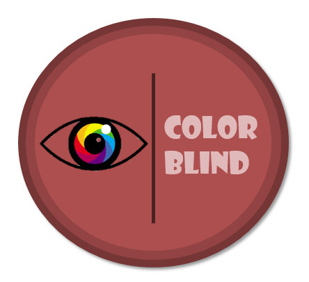
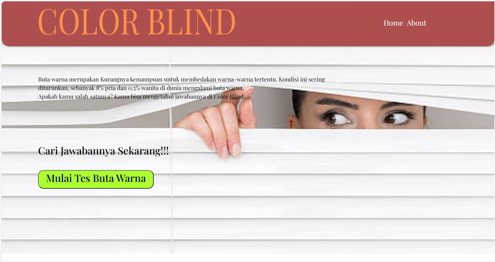
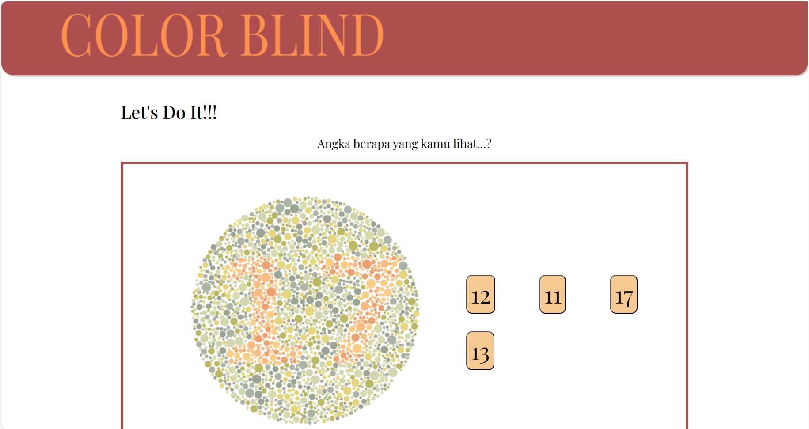
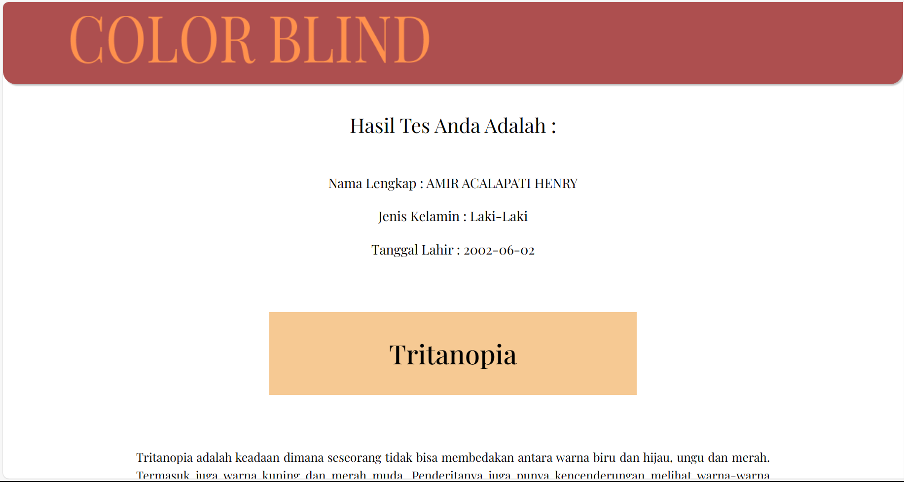

[![Contributors][contributors-shield]][contributors-url]
[![Forks][forks-shield]][forks-url]
[![Stargazers][stars-shield]][stars-url]
[![Issues][issues-shield]][issues-url]
[![LinkedIn][linkedin-shield]][linkedin-url]

<!-- PROJECT LOGO -->
 

  

  <h1 align="center">Color Blind Website</h3>

  

    A great website that can help identify color blindness symptoms.
     
    <a href="https://github.com/acalapatih/ColorBlind_website"><strong>Explore the docs »</strong></a>
     
     
    <a href="https://colorblind-project.netlify.app/">View Demo</a>
    ·
    <a href="https://github.com/acalapatih/ColorBlind_website/issues">Report Bug</a>
    ·
    <a href="https://github.com/acalapatih/ColorBlind_website/issues">Request Feature</a>
  

<!-- TABLE OF CONTENTS -->

  
Table of Contents

  <ol>
    <li><a href="#introduction">Introduction</a></li>
    <li><a href="#mock-up">Mock Up</a></li>
    <li><a href="#features">Features</a></li>
    <li>
      <a href="#about-the-project">About The Project</a>
      <ul>
        <li><a href="#build-with">Build With</a></li>
      </ul>
    </li>
  </ol>

## Introduction
ColorBlind is a useful website for conducting color blindness tests using the Ishihara Test method. The test results will indicate the type of color blindness experienced by the user. Additionally, the website also provides interesting information about color blindness.

## Mock Up

## Features
- Home
- Color Blind Test
- Fact of Color Blind
- Type of Color Blind
- Method of Color Blind Test
- About Us

## About The Project
### Build With
- [HTML](https://www.w3schools.com/html/)
- [CSS](https://www.w3schools.com/css/)
- [Javascript](https://www.w3schools.com/js/)

<!-- MARKDOWN LINKS & IMAGES -->
<!-- https://www.markdownguide.org/basic-syntax/#reference-style-links -->
[contributors-shield]: https://img.shields.io/github/contributors/acalapatih/ColorBlind_website.svg?style=for-the-badge
[contributors-url]: https://github.com/acalapatih/ColorBlind_website/graphs/contributors
[forks-shield]: https://img.shields.io/github/forks/acalapatih/ColorBlind_website.svg?style=for-the-badge
[forks-url]: https://github.com//acalapatih/ColorBlind_website/network/members
[stars-shield]: https://img.shields.io/github/stars/acalapatih/ColorBlind_website.svg?style=for-the-badge
[stars-url]: https://github.com//acalapatih/ColorBlind_website/stargazers
[issues-shield]: https://img.shields.io/github/issues/acalapatih/ColorBlind_website.svg?style=for-the-badge
[issues-url]: https://github.com//acalapatih/ColorBlind_website/issues
[linkedin-shield]: https://img.shields.io/badge/-LinkedIn-black.svg?style=for-the-badge&logo=linkedin&colorB=555
[linkedin-url]: https://linkedin.com/in/amir-acalapati-henry
